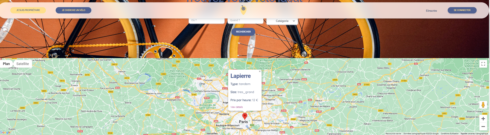

# LOCAVELOW : Projet Fullstack Session Automne 2023

[](https://forthebadge.com)

_Avant propos_

Github de l'équipe : [Arabicode](https://github.com/Arabicode-team)
Le site Locavelow en production : 
Le lien du Trello :

# Locavelow, c'est quoi ?

Locavelow est une plateforme de location de vélos entre particuliers. Le but est de faciliter la connexion entre les propriétaires de vélos et les cyclistes occasionnels, urbains ou ruraux, tout en favorisant une mobilité durable.

## Fonctionnalités 

1. **Location de vélos**

Locavelow permet aux utilisateurs de mettre leur vélo en location ou de louer le(s) vélo(s) d'un autre utilisateur.

2. **Réservations et gestion des disponibilités**

Un calendrier a été implementé pour la réservation, sur la page show d'un vélo. 

Il tient compte des créneaux disponibles, vérifie aussi que la date ne soit pas dans le passé.

3. **Notifications par emails**

Les utilisateurs peuvent recevoir des rappels de réservation à venir un jour avant la date si la reservation n'a pas été annulée.

Ils reçoivent aussi des confirmations de réservation, des rappels avant le début de la location par email.

Cette fonctionnalité est active pour les propriétaires et les locataires de vélos.

Le fuseau horaire par défaut de l'application a été défini sur Paris.

## Comment utiliser Locavelow en production 

_Inscription :_ Créez un compte Locavelow et recevez votre email de bienvenue.

_Recherche et réservation :_ Parcourez les vélos disponibles sur la carte de l'API Google Maps ou sur les cards Bootstrap affichant les annonces, choisissez celui qui vous convient, et effectuez votre réservation en payant par Stripe.

_Confirmation _: Recevez une confirmation détaillée de votre réservation, y compris les informations sur le vélo et le propriétaire. Vous recevrez aussi un rappel un jour avant la reservation si celle-ci n'a pas été annulée.

# La base de données 

## Schema


## Modèles

### Utilisateur (User)

- Authentification avec Devise (email, mot de passe)
- Peut posséder plusieurs vélos (bicycles)
- Peut créer plusieurs locations (rentals)
- Peut laisser des avis en tant que propriétaire (owner_reviews) et en tant que locataire (renter_reviews)
- Peut être administrateur (admin)

### Vélo (Bicycle)

- Appartient à un utilisateur (owner)
- Peut avoir plusieurs locations (rentals)
- Peut avoir plusieurs accessoires (accessories)
- Types de vélos (route, montagne, hybride, etc...)
- Tailles (petit, moyen, grand, etc.)

### Location (Rental)

- Associée à un vélo (bicycle)
- Associée à un locataire (renter)
- Possède des avis liés à la location (avis du propriétaire owner_review et avis du locataire renter_review)
- Dates de début et de fin de location
- Statut de la location

### Avis (Review)

- Associé à une location (rental)
- Utilisateur évalué (reviewed_user)
- Utilisateur évaluateur (reviewer_user)
- Note et texte de l'avis
- Date de l'avis

### Accessoire (Accessory)

- Associé à un vélo (bicycle)
- Nom de l'accessoire

## Migrations

Les migrations sont configurées pour créer les tables suivantes dans la base de données :

- `users` pour les utilisateurs
- `bicycles` pour les vélos
- `rentals` pour les locations
- `reviews` pour les avis
- `accessories` pour les accessoires
- `active_storage` pour la gestion des images

Chaque table est détaillée avec des champs spécifiques, tels que les références aux clés étrangères, les types de données et les contraintes.

## Logique de suppression en cascade

Voici comment fonctionne la logique de suppression en cascade dans cette base de données :

1. **Utilisateur (User):**

   - Lorsqu'un utilisateur est supprimé, tous ses vélos (bicycles) sont également supprimés (`dependent: :destroy`).
   - Les locations (rentals) et les avis (reviews) associés à l'utilisateur ne sont pas supprimés. Leurs clés étrangères sont annulées (`dependent: :nullify`), permettant de conserver l'historique pour des raisons de rapport.

2. **Vélo (Bicycle):**

   - Lorsqu'un vélo est supprimé, tous ses accessoires (accessories) sont supprimés (`dependent: :destroy`).
   - Les locations associées au vélo ne sont pas supprimées mais leurs clés étrangères sont annulées (`dependent: :nullify`).

3. **Location (Rental):**

   - Lorsqu'une location est supprimée, les avis liés (owner_review, renter_review) sont également supprimés (`dependent: :destroy`).

Cela signifie que la suppression d'un utilisateur entraîne la suppression de ses vélos et accessoires, mais les locations et les avis restent avec des clés étrangères annulées. C'est important pour maintenir l'historique des transactions et des avis, même après la suppression des profils des utilisateurs.

## Tests en console 

1. **Obtenir tous les vélos d'un utilisateur:**

   ```ruby
   user = User.first
   user.bicycles
   ```

2. **Obtenir des informations sur le propriétaire d'un vélo:**

   ```ruby
   Bicycle.first.owner
   ```

3. **Obtenir des informations sur une location et les avis liés à cette location:**

   ```ruby
    rental = Rental.first
    rental.bicycle
    rental.renter
    rental.owner_review
    rental.renter_review
   ```

. **Obtenir tous les vélos et leurs propriétaires:**

   ```ruby
    Bicycle.includes(:owner).all
   ```

# La gestion des images et le tableau de bord administrateur 

## Utilisation actuelle d'Administrate

Dans l'état actuel de notre application, nous utilisons la gem `administrate` pour générer des tableaux de bord admin. 

`administrate` offre une solution pour créer une interface administrative simple et flexible sans trop de configuration.

`administrate` nous permettra d'effectuer des opérations CRUD sur nos modèles (pas encore implémentée à 100%). 

Nous pouvons lister, afficher, créer, mettre à jour et supprimer des enregistrements directement depuis le tableau de bord. La gem prend également en charge le tri et la recherche par défaut.

Pour l'utiliser localement, vous devrez créer une instance de `User` qui soit admin (depuis votre console Rails) et aller dans l'URL `/admin`.

## Ajout d'images dans les modèles User & Bicycle

Nous avons mis en place l'upload d'images dans nos modèles `User` et `Bicycle`. 

Cela permet aux utilisateurs d'ajouter des photos de profil et des images de vélos.

- Dans le modèle `User`, nous avons un attribut `profile_picture` pour stocker la photo de profil de l'utilisateur.
- Dans le modèle `Bicycle`, nous avons un attribut `image` pour stocker les images des vélos.

## Formats des images

Nous prenons en charge plusieurs formats d'image pour les téléchargements, notamment le JPEG, le PNG et le GIF. 

Ces formats ont été choisis pour leur large prise en charge et leur utilisation courante dans les applications web.

Vous devrez peut-être exécuter `sudo apt-get install libvips42` pour utiliser la bibliothèque de la gemme qui a été utilisée, 'image_processing'.


# Les API 

## Google Maps 

- Une carte a été ajoutée à la page listant toutes les annonces.
- Chaque annonce est marquée par un marker sur la carte.
- En cliquant sur un marker, une fenêtre d'information s'ouvre, affichant les détails de l'annonce et un lien vers sa page.
- Sur la page de création d'une annonce, un formulaire d'adresse avec autocomplétion a été implémenté.
- Lorsqu'une adresse est sélectionnée, un marker correspondant est automatiquement positionné sur la carte.
- Chaque annonce dispose désormais d'une carte montrant l'emplacement précis du vélo.
- Ces améliorations visent à améliorer l'expérience utilisateur en fournissant des visualisations interactives et des fonctionnalités utiles pour une meilleure localisation des vélos disponibles.




<br>


## Mailjet et ActionMailer

`letter_opener_web` est une gem pour voir les e-mails dans le navigateur en serveur local au lieu de les envoyer réellement. Il y a une boite email commune pour toutes les adresses de la BDD en dev, ce qui est très pratique. On reçoit tout au même endroit et on peut vérifier l'affichage en `html.erb` et aussi en version simplifiée `text.erb`. Nous l'avons utilisé en developpement.


- Une fois que la gem est installée, voici comment l'utiliser :

1. Exécutez votre application Rails en mode de développement.
2. Envoyez des e-mails en utilisant les méthodes qui ont été implémentées.
3. Consultez la boîte de réception pour visualiser les emails envoyés et vérifier qu'ils soient reçus.
4. Accédez à l'URL suivante dans votre navigateur : [Serveur local - page de la gem letter_opener](http://localhost:3000/letter_opener)

### Tests en console

Voici quelques exemples pour tester les méthodes avec `letter_opener_web` depuis la console Rails :

1. **Tester l'email de bienvenue :**
    ```ruby
    user = User.first
    user.welcome_send
    ```

2. **Tester un rappel de réservation à venir pour le locataire :**
    ```ruby
    rental = Rental.find() # la location doit être prévue dans 1 jour ou moins
    rental.renter_schedule_upcoming_reminder
    ```

3. **Tester un envoi de la confirmation de réservation pour le propriétaire :**

    ```ruby
    rental = Rental.find() # la location doit être en statut in_progress uniquement
    rental.send_owner_confirmation_email
    ```

4. **Test d'envoi d'un email de réinitialisation de mot de passe personnalisé :**

    ```ruby
    user = User.first
    user.send_reset_password_instructions
    ```

### Exemples d'emails 


<br>


## Stripe 

Stripe a été intégré pour faciliter les paiements sécurisés lors de la location de vélos. Le processus commence dans la vue `bicycle/show.html.erb`, où l'utilisateur peut remplir un formulaire pour initier une location.

### Création de la session de paiement

Le contrôleur `RentalsController` gère la logique de création de la session de paiement Stripe. Dans la méthode `confirm`, une session Stripe est créée avec les détails de paiement nécessaires. L'utilisateur est ensuite redirigé vers une page Stripe pour compléter le paiement.

### Formulaire de réservation

Dans la vue `bicycle/show.html.erb`, l'utilisateur remplit un formulaire de réservation, définissant les dates de début et de fin de la location. Après la soumission, la méthode `create` du `RentalsController` est appelée, créant un nouvel objet `Rental` et stockant les détails dans la session.

### Confirmation de la location

Après le paiement, l'utilisateur est redirigé vers la méthode `payment_success` du `RentalsController`. Si le paiement est confirmé, une instance de `Rental` est créée et sauvegardée dans la base de données, finalisant ainsi le processus de location.

### Confirmation

La vue `confirm.html.erb` affiche les détails de la location en attente et offre un bouton pour procéder au paiement via Stripe.

## Bonus: intégration de simple_calendar, calcul dynamique du coût, mise à jour dynamique des status des locations

### Utilisation de simple_calendar pour la visualisation des créneaux

La gem simple_calendar a été intégrée pour améliorer la visualisation des périodes de réservation des vélos. Cette intégration permet aux utilisateurs de voir rapidement les dates disponibles ou non pour chaque vélo.

### Customisation du calendrier

Le calendrier a été personnalisé dans `app/helpers/bicycle_helpers` pour afficher les intervalles de réservation de chaque vélo. Les utilisateurs peuvent ainsi voir les heures exactes pendant lesquelles le vélo est réservé.

### Calcul dynamique du coût de la location

Un script JavaScript a été ajouté pour calculer dynamiquement le coût total de la location en fonction des dates et heures sélectionnées. Ce calcul se base sur le prix par heure du vélo et met à jour le coût estimé à mesure que l'utilisateur choisit les dates de début et de fin.

### Avantages de la mise à jour dynamique du coût pour l'utilisateur

Dans la vue de réservation, les utilisateurs remplissent un formulaire pour sélectionner les dates et heures de location. Le coût estimé est affiché en temps réel, offrant ainsi une transparence totale sur le prix attendu de la location.

### Mise à jour dynamique du statut des locations avec Active Job

Un tâche périodique a été crée qui vérifiera automatiquement toutes les 5 minutes si une location est terminé. Vous verrez parfois cette tâche apparaître dans votre rails console (lorsque le console est en cours d'exécution) ou dans le terminal quand le serveur local est lancé.

Bonne nouvelle : la mise à jour s'effectue même si la console n'est pas en cours d'utilisation !

Le processus démarre automatiquement lorsqu'il y a du trafic en cours sur le site en production/le serveur local.

- Exemple en console : 

```ruby

3.2.2 :014 > 

#1 Aucune location in_progress n'a été trouvé mais la vérification s'est quand même executée

UpdateRentalStatusJob started at 2023-12-07 15:47:20 +0100
  Rental Load (1.1ms)  SELECT "rentals".* FROM "rentals"
UpdateRentalStatusJob finished at 2023-12-07 15:47:20 +0100

#2 Une location in_progress qui vient de se terminer il y a 5 minutes a été trouvée et mise à jour par la tâche

UpdateRentalStatusJob started at 2023-12-07 15:37:20 +0100
  Rental Load (0.6ms)  SELECT "rentals".* FROM "rentals"
  TRANSACTION (0.2ms)  BEGIN
  Rental Update (1.2ms)  UPDATE "rentals" SET "rental_status" = $1, "updated_at" = $2 WHERE "rentals"."id" = $3  [["rental_status", 1], ["updated_at", "2023-12-07 14:37:20.770615"], ["id", 61]]
  TRANSACTION (3.4ms)  COMMIT
UpdateRentalStatusJob finished at 2023-12-07 15:37:20 +0100

```

- Exemple dans le terminal : 

```bash

=> Booting Puma
=> Rails 7.1.2 application starting in development 
=> Run `bin/rails server --help` for more startup options
  Rental Load (2.5ms)  SELECT "rentals".* FROM "rentals"
  ↳ app/jobs/update_rental_status_job.rb:6:in `perform'
Puma starting in single mode...
(...)
Use Ctrl-C to stop
UpdateRentalStatusJob finished at 2023-12-07 16:19:26 +0100
UpdateRentalStatusJob started at 2023-12-07 16:24:26 +0100
  Rental Load (0.7ms)  SELECT "rentals".* FROM "rentals"
  ↳ app/jobs/update_rental_status_job.rb:6:in `perform'
UpdateRentalStatusJob finished at 2023-12-07 16:24:26 +0100

```

# Front-End : Bootstrap, CSS, Javascript

## Utilisation d'un thème bootstrap personnalisé

Nous avons intégré une base de thème Bootstrap pour notre application, que nous avons ensuite personnalisé pour correspondre à notre charte graphique. 

Des modifications ont été apportées aux couleurs, aux polices et à la disposition générale pour offrir une expérience utilisateur cohérente.

## Avantages 

L'utilisation de Bootstrap a simplifié le processus de conception en fournissant des composants prêts à l'emploi et une structure de grille flexible. 

## La maquette Figma du projet 

Elle est disponible ici : [Figma Locavelow](https://www.figma.com/file/6xWBCB7ycGXbz2zLlODMmC/Locaveloww?type=design&node-id=0-1&mode=design)


# L'équipe Arabicode 

[](https://forthebadge.com)

- [Marina](https://github.com/masechkacat)
- [Sylvain](https://github.com/JerkStanton)
- [Grégory](https://github.com/100PBaguuette)
- [Cyprien](https://github.com/cypradoux)
- [Ikrame](https://github.com/ikramiste)

